# Instacalc for Obsidian (beta)

I made this plugin so you can do math, convert units, draw charts, and run LaTeX right inside your notes.

It's the [instacalc.com](https://instacalc.com) engine, brought into Obsidian to run on your own device. Your math is local-first: every calculation runs inside Obsidian, works offline, and your notes stay in your vault. The plugin only goes online for the few things listed under [Privacy](#privacy).

[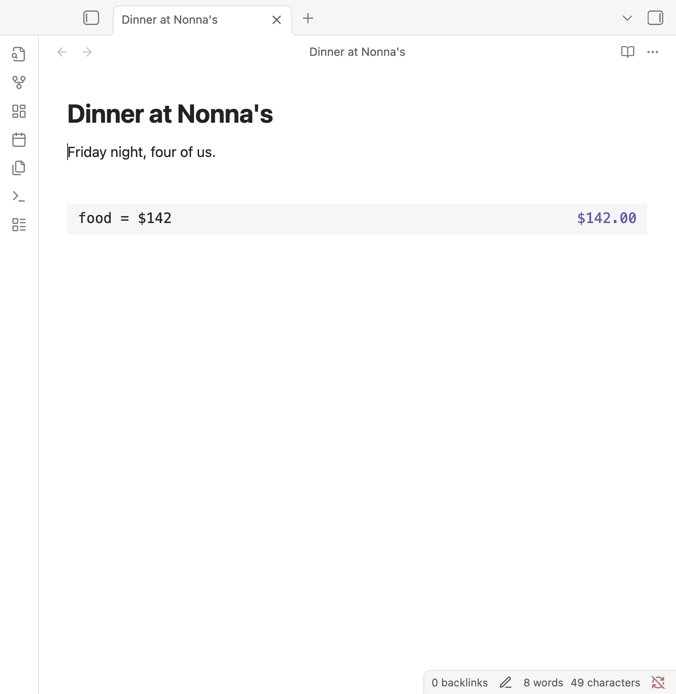](media/walkthrough.mp4)

*Click for the 70-second walkthrough.*

<!-- schematic:start (generated by pnpm obsidian:lesson-demos; edits here are overwritten) -->
<picture>
  <source media="(prefers-color-scheme: dark)" srcset="media/schematic-dark.png">
  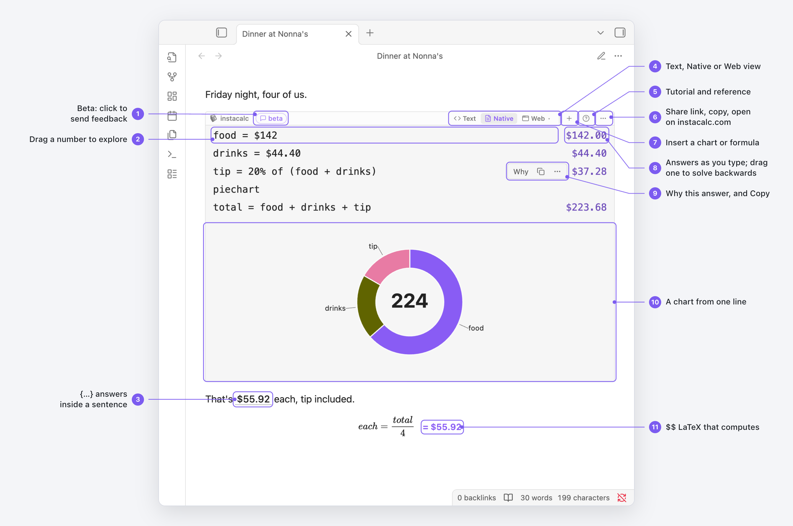
</picture>
<!-- schematic:end -->

> **Beta:** This plugin is in development and may be unstable. The Obsidian-specific syntax, like `{…}` answers and how you query your vault, may change slightly before 1.0. BRAT keeps you on the latest build.

## Looks like your Obsidian

Calc blocks use your theme's colours and fonts, and follow it when you switch themes.

The Web view (the full instacalc.com app inside a note) will match your theme the same way. That is coming with the next instacalc.com update; the clip below is a preview of it.

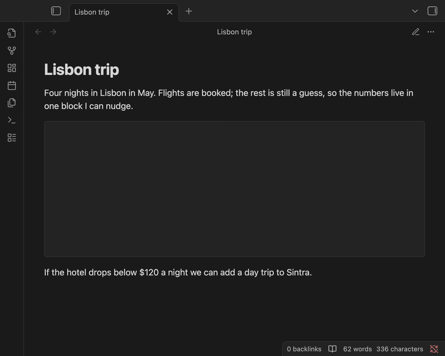

## How it compares

<picture>
  <source media="(prefers-color-scheme: dark)" srcset="media/compare-dark.png">
  
</picture>

## What it does

- Write math using plain words, like `rent = $1,850/month` and then `rent * 1 year`. Units and currencies convert automatically.
- Put answers right inside your sentences by writing `{total / 4}` anywhere in a paragraph.
- Calculate LaTeX formulas, so `$$\frac{1}{2} \cdot 9.8 \cdot 3^2$$` shows its answer.
- Make charts from your numbers by adding a `barchart` or `piechart` line to a block.
- Try out what-ifs by dragging a number, or drag an answer to solve backwards.
- Use values from around your vault, including `[[Budget]].limit`, markdown tables, and folder totals.
- Name a note `.ic.md` to make every line compute.
- Share your work with one click. It makes a link with the whole calculation in the URL path.

## Install

**Requirements:** Obsidian 1.4.0 or later, on desktop or mobile. Mobile is less tested in this beta.

The beta installs through [BRAT](https://obsidian.md/plugins?id=obsidian42-brat), which also keeps it up to date.

<!-- After the site deploy that ships /obsidian/install, add: "With BRAT installed, [this link](https://instacalc.com/obsidian/install) opens its install dialog with Instacalc filled in. Or step by step:" -->

1. Install **BRAT** from Community plugins and enable it.
2. Open Settings → **BRAT**. Next to **Beta plugin list**, click **+**.
3. Paste `kazad/instacalc-obsidian`, choose the newest version under **Select a version**, and click **Add plugin**.

After that, open the command palette and run **Instacalc: Create tutorial notes**, or you can [read the tutorial here](examples/Instacalc%20Tutorial).

The plugin checks for updates once a day and lets you know when a new version is ready. You can turn this off in settings; see [Privacy](#privacy) for exactly what it sends.

## Recipes

You can paste any of these examples into a note to try them out. The `# …` comment on a line is the answer the plugin shows for it.

<!-- recipes:start (generated by pnpm obsidian:lesson-demos; edits here are overwritten) -->
**Split a bill**
````markdown
```ic
bill = $86.40
tip = 18% of bill         # $15.55
each = (bill + tip) / 4   # $25.49
```
````

**An answer inside a sentence**
````markdown
```ic
guests = 8
total = $260
```
Dinner comes to {total}, which is {total / guests} each.
````
Shows: Dinner comes to $260.00, which is $32.50 each.

**Trip budget in another currency**
````markdown
```ic
hotel = 180 USD * 6       # 1,080.00 USD
flights = 1450 USD
total = hotel + flights   # 2,530.00 USD
total in EUR              # €2,175.80
```
````
Euros at the rates built into the plugin; once it downloads the day's rates, your answer will differ a little.

**Units and dates**
````markdown
```ic
5 km in miles   # 3.107 miles
today + 90 days
```
````

**A value from another note** (its frontmatter has `hourly: 150`)
````markdown
```ic
fee = [[Rates]].hourly * 12   # 1,800
```
````

**Add up a folder** (three notes, each with `amount: 12` in its frontmatter)
````markdown
```ic
spend = vaultsum("Expenses/**", amount)   # 36
```
````

**Sum a column of a markdown table** in the same note
````markdown
## Materials

| Item | Cost |
|---|---|
| wood | 120 |
| screws | 15 |
| paint | 45 |

```ic
sum(table("Materials", Cost))   # 180
```
````

**Chart it**
````markdown
```ic
rent = 1850
food = 600
fun = 300
piechart
```
````
<!-- recipes:end -->

## Live data

`import("<url>")` reads JSON or CSV from a URL, and `csv("Data/sales.csv")` reads a .csv file in your vault. Both update when the source changes.

For example, [Datasette](https://datasette.io) serves any SQLite database as JSON. Add `_shape=array` to get a list of rows:

````markdown
```ic
spots = import("https://latest.datasette.io/fixtures/roadside_attractions.json?_shape=array&_col=name&_col=latitude") // @sheet
floor = 95 // 80..100 by 1
rows = import(concat("https://latest.datasette.io/fixtures/-/query.json?_shape=array&sql=select+content,+sortable+from+sortable+where+sortable+%3E%3D+:floor&floor=", floor))
matches = count(rows)
```
````

Filter with `?column=value`, pick columns with `&_col=`, and pass SQL parameters (`:floor`) as URL arguments, so the server does the filtering. If a site answers with a login or bot-check page instead of data, the row says so.

## Using your vault

Your notes' properties (frontmatter) are numbers you can calculate with.

| Write | You get |
|---|---|
| `rate * hours` | `rate` from this note's own properties |
| `[[Rates]].hourly` | the `hourly` property of the note Rates |
| `[[Rates]]` | that note's main number (`value`, `result`, `total` or `amount`, or its only number) |
| `vaultsum("Expenses/*", amount)` | `amount` added up across a folder; also `vaultavg`, `vaultmin`, `vaultmax`, `vaultcount` |
| `vaultsum("#trip", cost)` | the same, for every note with a tag |
| `vaulttable("#project", budget, status)` | one row per note, to sum, filter or chart |
| `table("Materials", Cost)` | a column of a markdown table in this note |

Properties can carry units and currencies (`weight: 12 kg`, `price: 40 EUR`), and answers update when those notes change.

## Share links

When you create a share link, the calculation is written directly into the URL path. Rows are joined by `;`, spaces become `_`, and the note name comes first:

```
https://instacalc.com/%23_Japan_trip;nights_=_6;hotel_=_180_USD_*_nights;hotel_in_JPY
```

Anyone with the link can open it and see the live calculation. They do not need Obsidian or an account, and nothing is stored on a server. Any values pulled from other notes are written into the link too, so it works completely on its own.

<!-- lesson-gallery:start (generated by pnpm obsidian:lesson-demos; edits here are overwritten) -->
## Gallery

What Instacalc does in a note: calculus, charts, money, science, your vault as data, and the views.
Click a picture for its note (or its animation); every example is also in the [example vault](examples/Instacalc%20Tutorial/Showcase/),
and every number in them is one the plugin's test suite checks.

<table>
<tr><td align="center" valign="top" width="33%"><a href="examples/Instacalc%20Tutorial/Showcase/Calculus.md">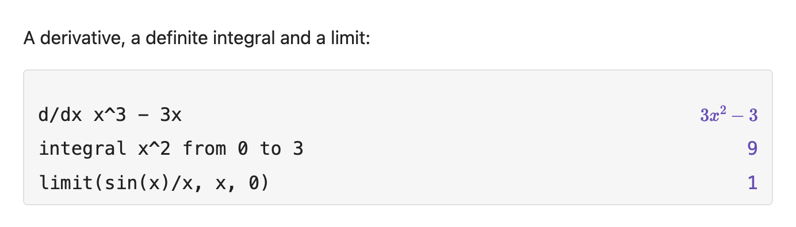</a><br><a href="examples/Instacalc%20Tutorial/Showcase/Calculus.md"><b>Calculus</b></a><br><sub>Derivatives, integrals and limits, worked out as you type</sub></td><td align="center" valign="top" width="33%"><a href="examples/Instacalc%20Tutorial/Showcase/A%20function%20and%20its%20slope.md">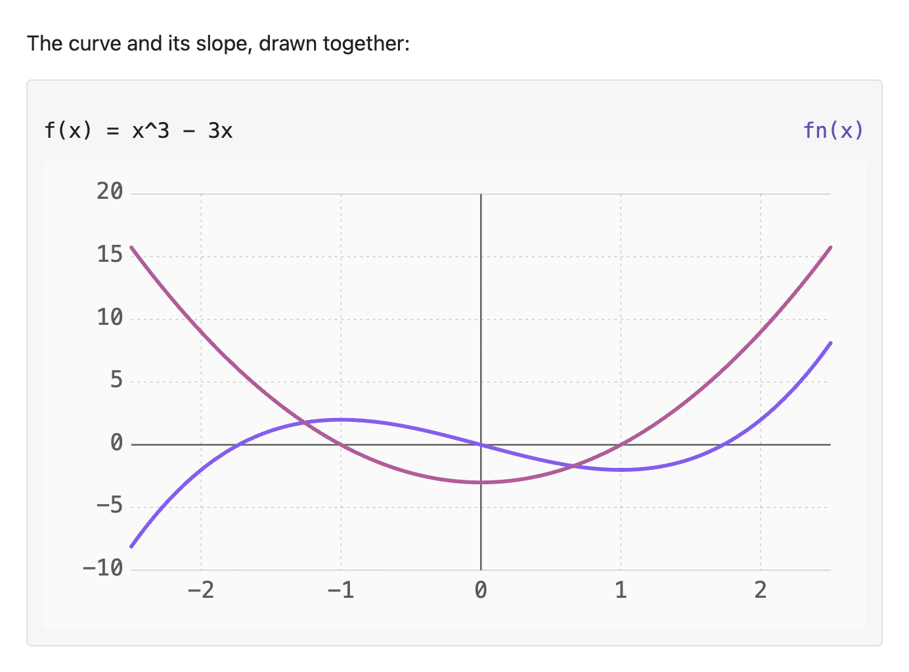</a><br><a href="examples/Instacalc%20Tutorial/Showcase/A%20function%20and%20its%20slope.md"><b>A function and its slope</b></a><br><sub>Plot f and its derivative on one graph</sub></td><td align="center" valign="top" width="33%"><a href="examples/Instacalc%20Tutorial/Showcase/Growth%20curves.md">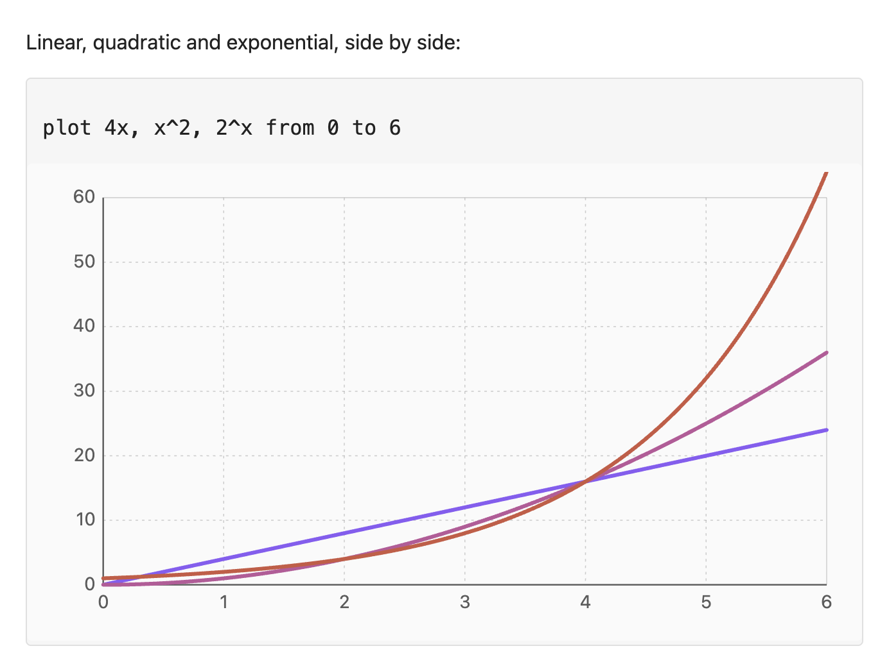</a><br><a href="examples/Instacalc%20Tutorial/Showcase/Growth%20curves.md"><b>Growth curves</b></a><br><sub>Several functions on one plot: which grows fastest?</sub></td></tr>
<tr><td align="center" valign="top" width="33%"><a href="examples/Instacalc%20Tutorial/Showcase/Surface.md">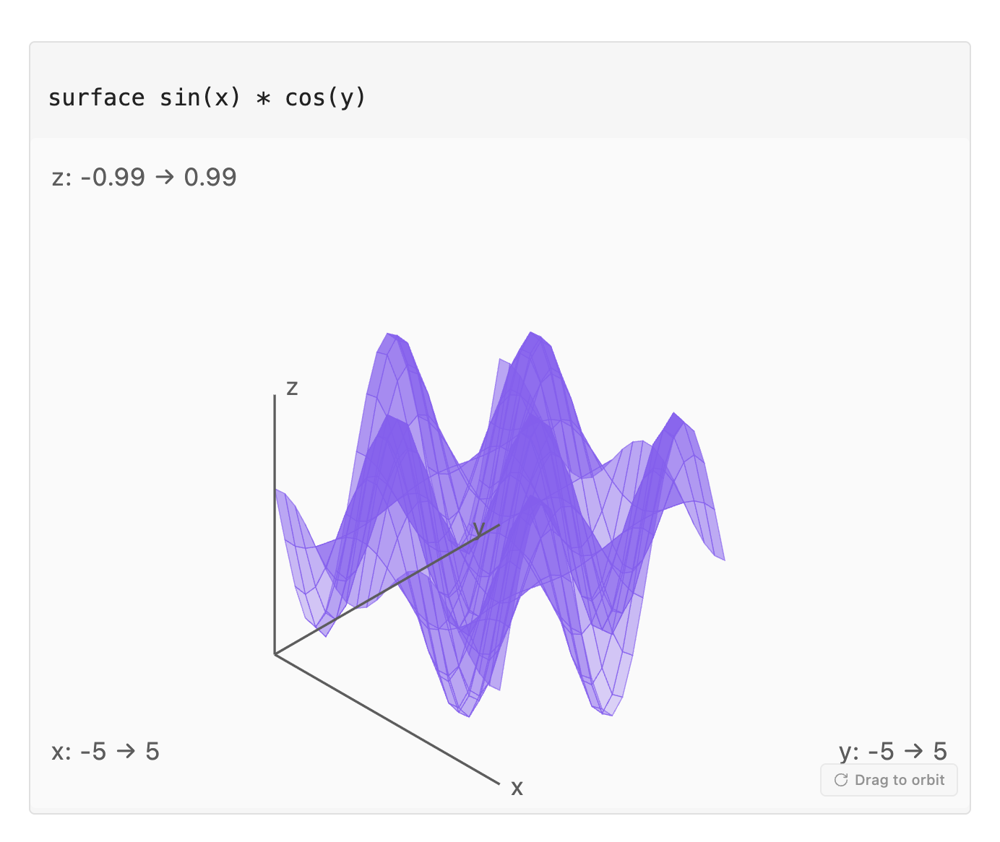</a><br><a href="examples/Instacalc%20Tutorial/Showcase/Surface.md"><b>A 3D surface</b></a><br><sub>One line draws a surface; drag it to turn it</sub></td><td align="center" valign="top" width="33%"><a href="examples/Instacalc%20Tutorial/Showcase/Monthly%20spending.md">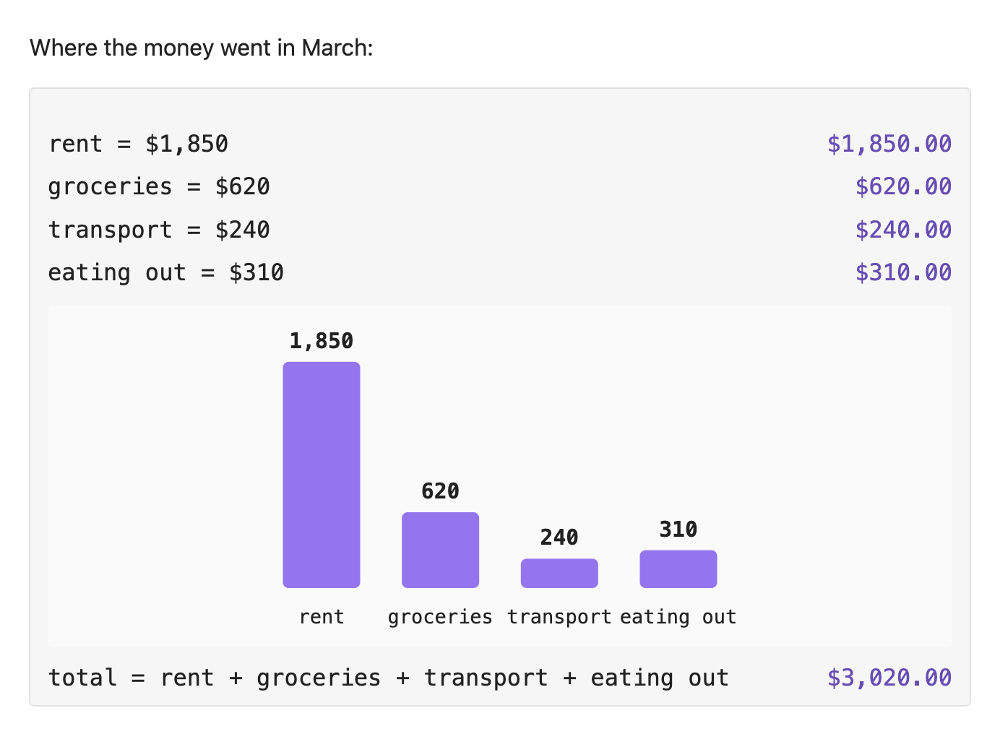</a><br><a href="examples/Instacalc%20Tutorial/Showcase/Monthly%20spending.md"><b>Monthly spending</b></a><br><sub>A bar chart from the numbers above it</sub></td><td align="center" valign="top" width="33%"><a href="examples/Instacalc%20Tutorial/Showcase/A%20day.md">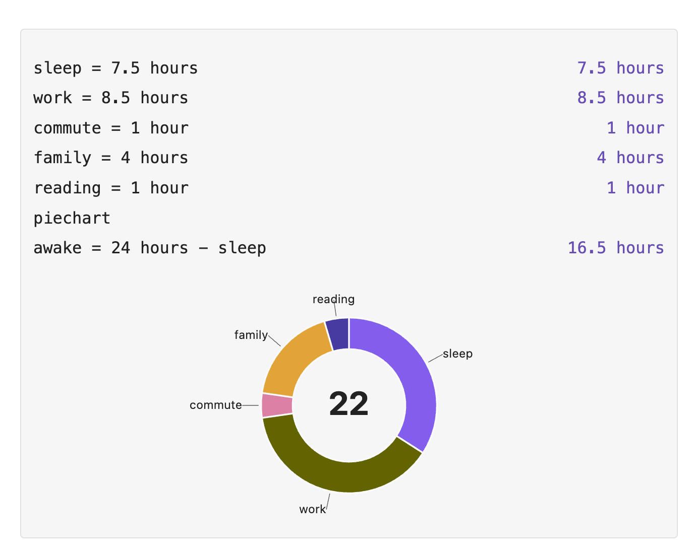</a><br><a href="examples/Instacalc%20Tutorial/Showcase/A%20day.md"><b>Where the day goes</b></a><br><sub>A pie chart, in your theme’s colours</sub></td></tr>
<tr><td align="center" valign="top" width="33%"><a href="examples/Instacalc%20Tutorial/Showcase/Compound%20growth.md">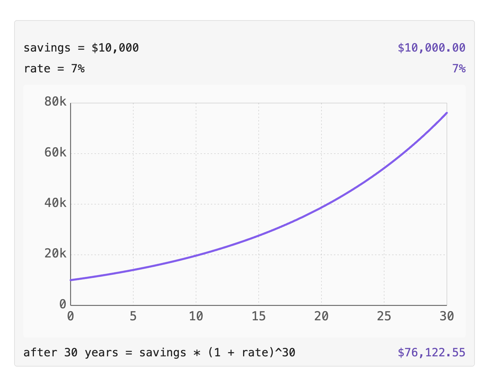</a><br><a href="examples/Instacalc%20Tutorial/Showcase/Compound%20growth.md"><b>Compound growth</b></a><br><sub>What $10,000 becomes at 7% a year</sub></td><td align="center" valign="top" width="33%"><a href="media/showcase/mortgage.gif">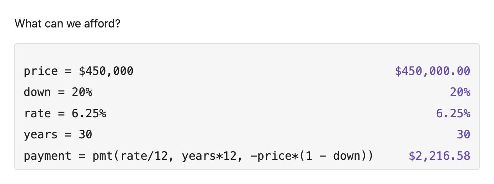</a><br><a href="examples/Instacalc%20Tutorial/Showcase/Mortgage.md"><b>Mortgage, solved backwards</b></a> (animated)<br><sub>Drag the payment to what you can afford; it solves for the price</sub></td><td align="center" valign="top" width="33%"><a href="examples/Instacalc%20Tutorial/Showcase/Tokyo%20prices.md">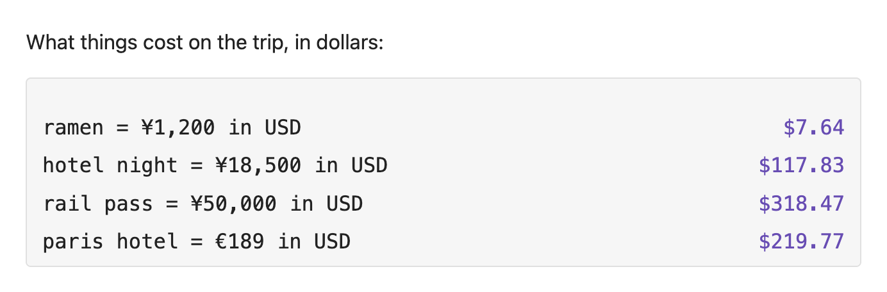</a><br><a href="examples/Instacalc%20Tutorial/Showcase/Tokyo%20prices.md"><b>Currency conversion</b></a><br><sub>Prices in yen and euros, converted to dollars as you write them</sub></td></tr>
<tr><td align="center" valign="top" width="33%"><a href="examples/Instacalc%20Tutorial/Showcase/Braking%20energy.md">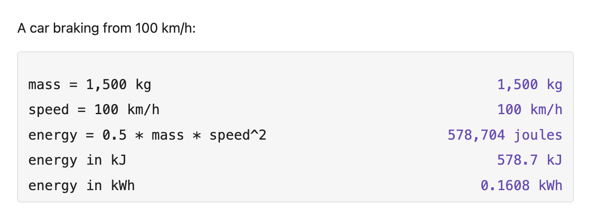</a><br><a href="examples/Instacalc%20Tutorial/Showcase/Braking%20energy.md"><b>Physics with units</b></a><br><sub>Units ride along through the whole calculation</sub></td><td align="center" valign="top" width="33%"><a href="examples/Instacalc%20Tutorial/Showcase/Conversions.md">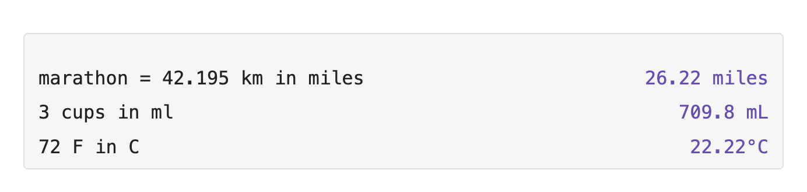</a><br><a href="examples/Instacalc%20Tutorial/Showcase/Conversions.md"><b>Unit conversions</b></a><br><sub>Say it the way you would say it</sub></td><td align="center" valign="top" width="33%"><a href="examples/Instacalc%20Tutorial/Showcase/Projectile.md">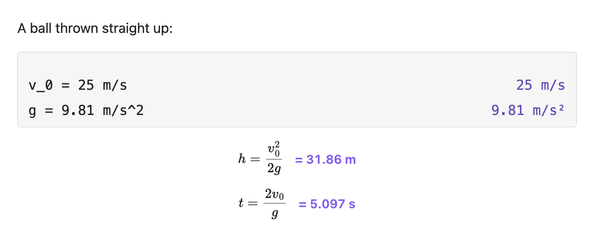</a><br><a href="examples/Instacalc%20Tutorial/Showcase/Projectile.md"><b>LaTeX that computes</b></a><br><sub>Write the formula; the answer appears beside it, with units</sub></td></tr>
<tr><td align="center" valign="top" width="33%"><a href="examples/Instacalc%20Tutorial/Showcase/Race%20times.md">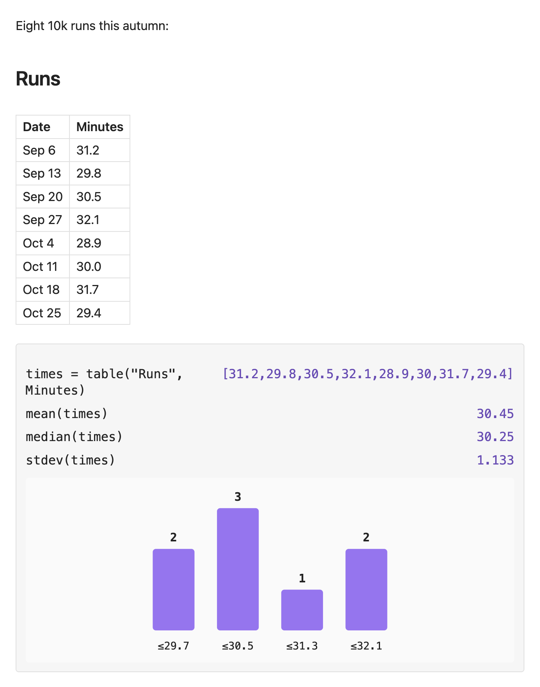</a><br><a href="examples/Instacalc%20Tutorial/Showcase/Race%20times.md"><b>Statistics</b></a><br><sub>Mean, spread and a histogram of your data</sub></td><td align="center" valign="top" width="33%"><a href="examples/Instacalc%20Tutorial/Showcase/Kitchen%20quote.md">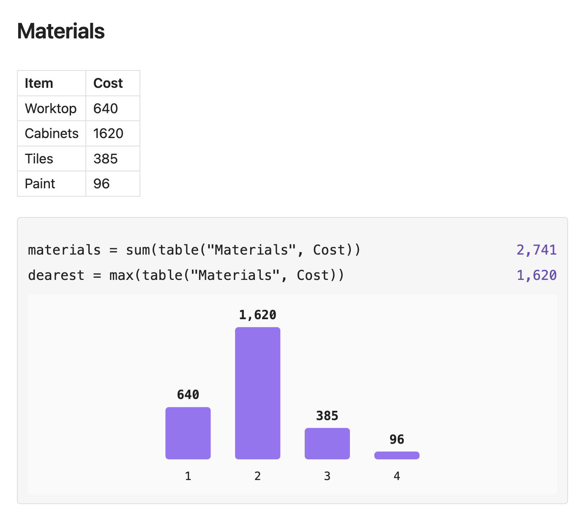</a><br><a href="examples/Instacalc%20Tutorial/Showcase/Kitchen%20quote.md"><b>A table is data</b></a><br><sub>Sum and chart a markdown table where it sits</sub></td><td align="center" valign="top" width="33%"><a href="examples/Instacalc%20Tutorial/Showcase/Portfolio.md">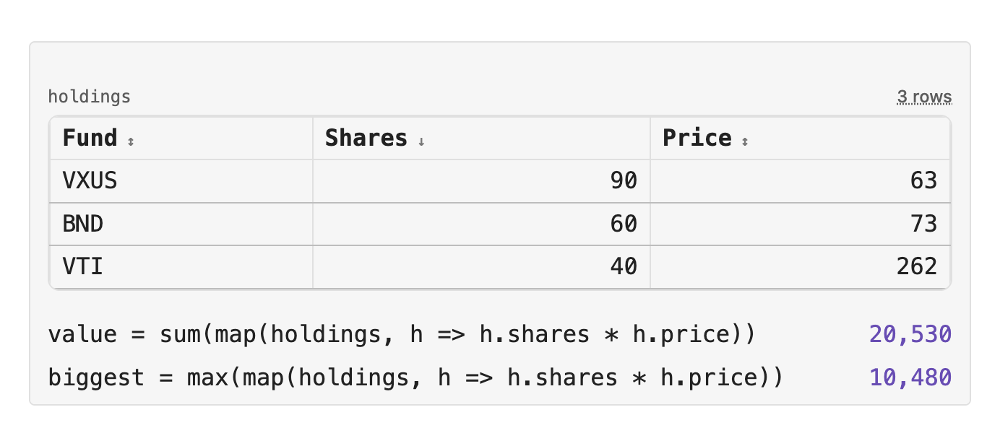</a><br><a href="examples/Instacalc%20Tutorial/Showcase/Portfolio.md"><b>A list is a sheet</b></a><br><sub>A list of records shows as a sheet; click a header to sort</sub></td></tr>
<tr><td align="center" valign="top" width="33%"><a href="examples/Instacalc%20Tutorial/Showcase/Sales.md">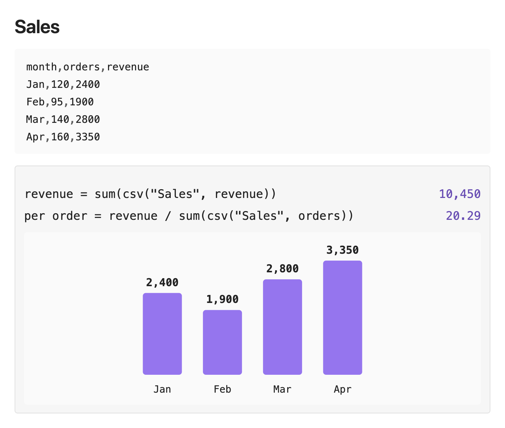</a><br><a href="examples/Instacalc%20Tutorial/Showcase/Sales.md"><b>CSV in a note</b></a><br><sub>Paste a CSV, then total and chart it</sub></td><td align="center" valign="top" width="33%"><a href="examples/Instacalc%20Tutorial/Showcase/Datasette%20table.md">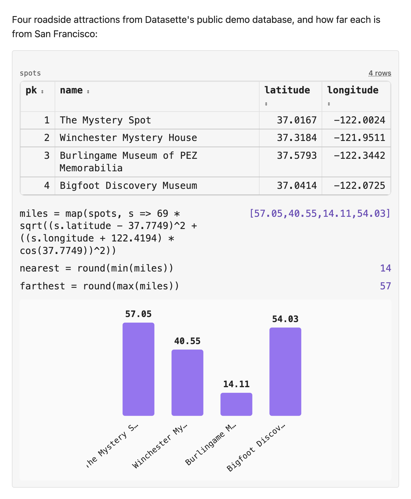</a><br><a href="examples/Instacalc%20Tutorial/Showcase/Datasette%20table.md"><b>A Datasette table</b></a><br><sub>Rows from a Datasette table, as a sheet and a chart</sub></td><td align="center" valign="top" width="33%"><a href="examples/Instacalc%20Tutorial/Showcase/Datasette%20query.md">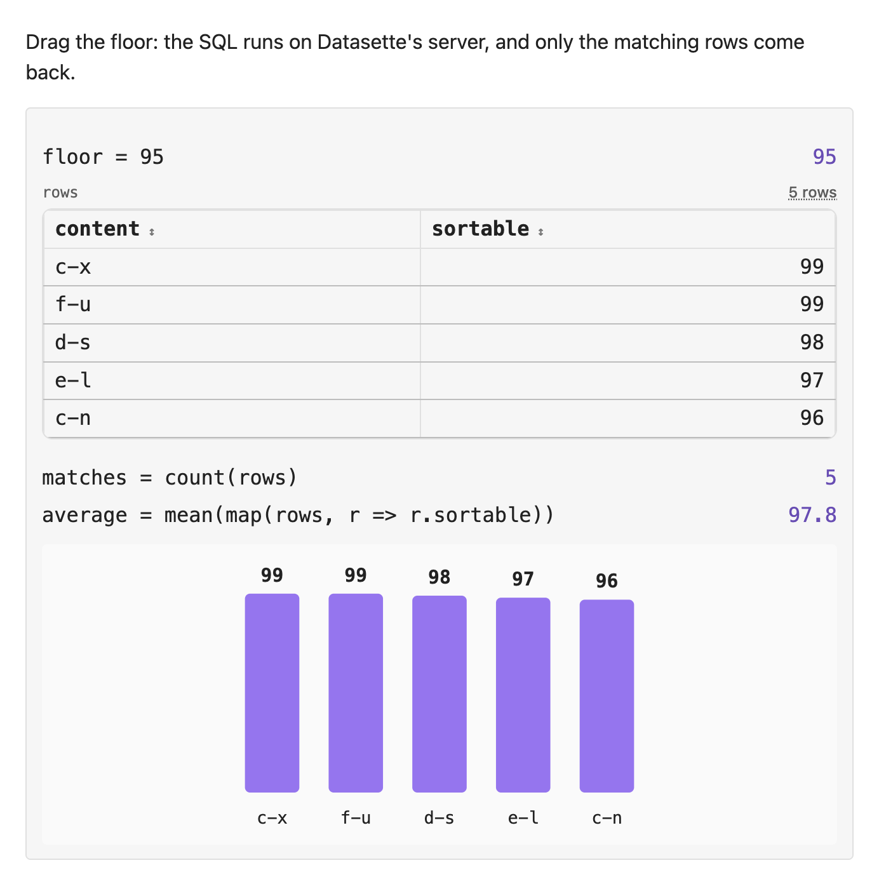</a><br><a href="examples/Instacalc%20Tutorial/Showcase/Datasette%20query.md"><b>SQL with a slider</b></a><br><sub>A slider feeds a SQL query; Datasette sends back only the matches</sub></td></tr>
<tr><td align="center" valign="top" width="33%"><a href="examples/Instacalc%20Tutorial/Showcase/Budget%20check.md">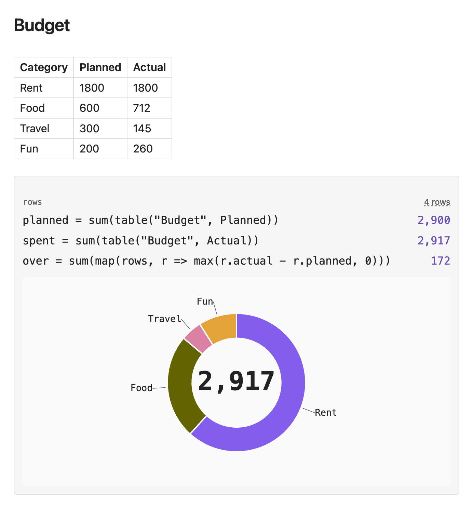</a><br><a href="examples/Instacalc%20Tutorial/Showcase/Budget%20check.md"><b>Budget vs actual</b></a><br><sub>Planned against spent, from a table you keep by hand</sub></td><td align="center" valign="top" width="33%"><a href="examples/Instacalc%20Tutorial/Showcase/Dinner%20party.md">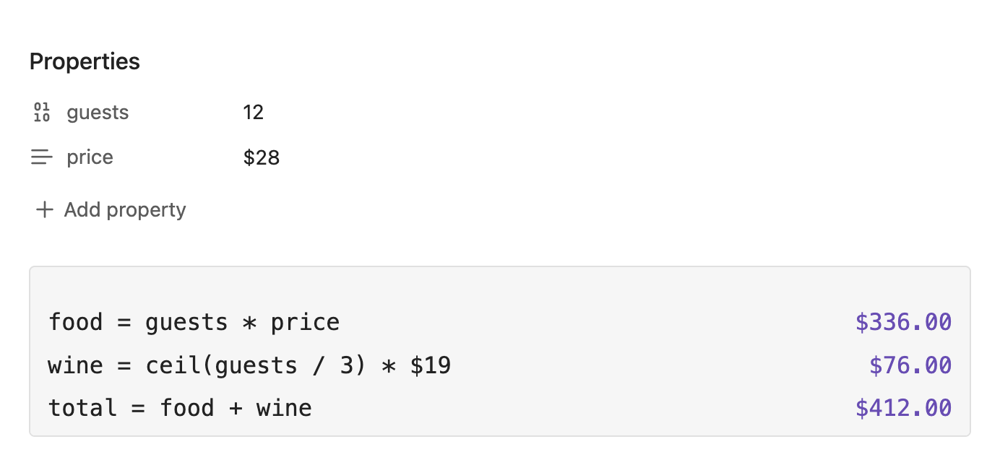</a><br><a href="examples/Instacalc%20Tutorial/Showcase/Dinner%20party.md"><b>Properties are variables</b></a><br><sub>A note’s own properties are names its calculations can use</sub></td><td align="center" valign="top" width="33%"><a href="examples/Instacalc%20Tutorial/Showcase/Invoice.md">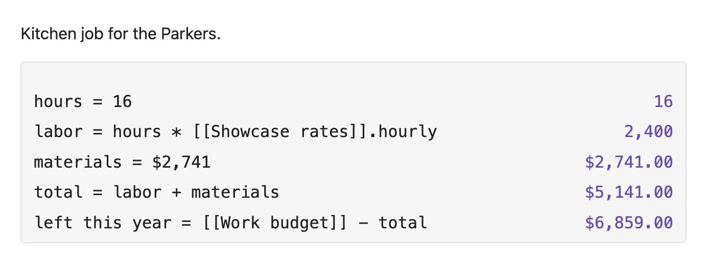</a><br><a href="examples/Instacalc%20Tutorial/Showcase/Invoice.md"><b>Numbers from other notes</b></a><br><sub>[[Note]].field reads one property; [[Note]] reads a note’s main number</sub></td></tr>
<tr><td align="center" valign="top" width="33%"><a href="examples/Instacalc%20Tutorial/Showcase/Coffee%20spend.md">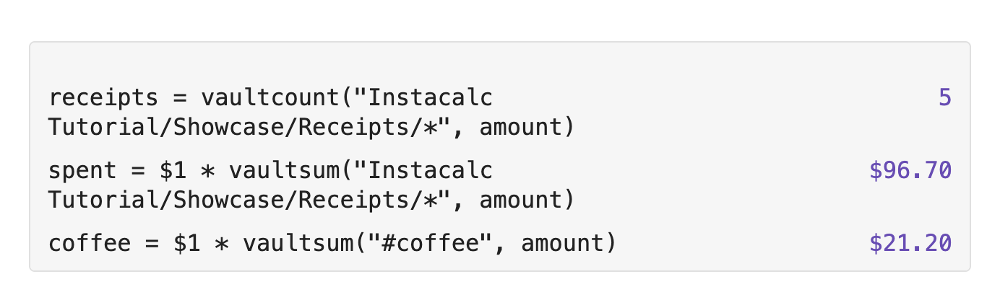</a><br><a href="examples/Instacalc%20Tutorial/Showcase/Coffee%20spend.md"><b>Totals across the vault</b></a><br><sub>Add up a property over a folder, or over every note with a tag</sub></td><td align="center" valign="top" width="33%"><a href="examples/Instacalc%20Tutorial/Showcase/Projects.md">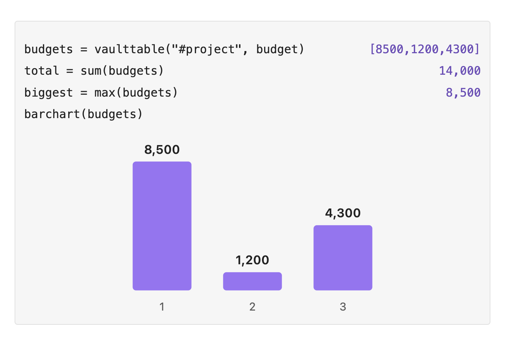</a><br><a href="examples/Instacalc%20Tutorial/Showcase/Projects.md"><b>A dashboard from tagged notes</b></a><br><sub>vaulttable collects a property from every #project note; chart it</sub></td><td align="center" valign="top" width="33%"><a href="examples/Instacalc%20Tutorial/Showcase/Countdown.md">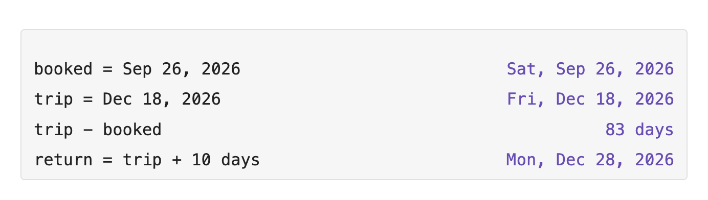</a><br><a href="examples/Instacalc%20Tutorial/Showcase/Countdown.md"><b>Dates</b></a><br><sub>Days between dates, and date arithmetic</sub></td></tr>
<tr><td align="center" valign="top" width="33%"><a href="examples/Instacalc%20Tutorial/Showcase/Dinner%20split.md">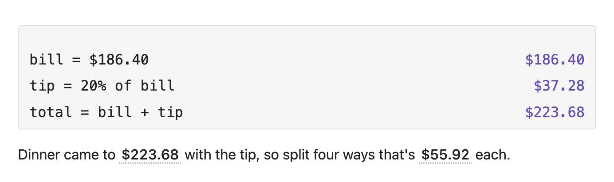</a><br><a href="examples/Instacalc%20Tutorial/Showcase/Dinner%20split.md"><b>Answers in a sentence</b></a><br><sub>Write {total / 4} in a paragraph and it becomes the number</sub></td><td align="center" valign="top" width="33%"><a href="media/showcase/lisbon-trip.gif">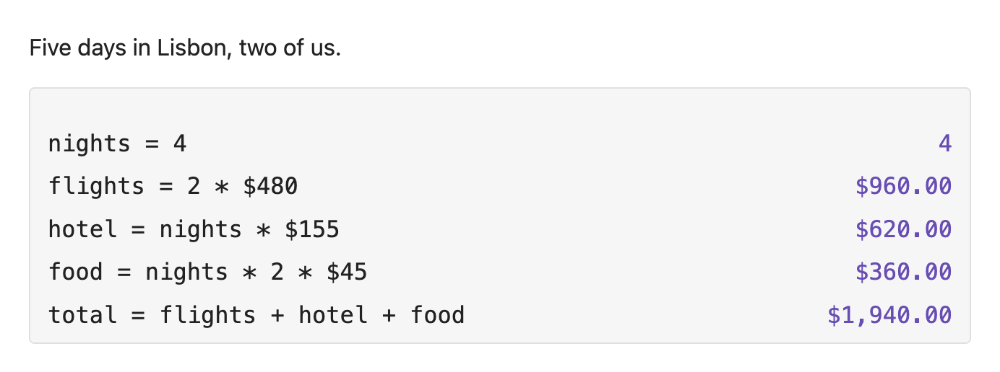</a><br><a href="examples/Instacalc%20Tutorial/Showcase/Lisbon%20trip.md"><b>Drag to explore</b></a> (animated)<br><sub>Drag a number sideways and everything below follows</sub></td><td align="center" valign="top" width="33%"><a href="examples/Instacalc%20Tutorial/Showcase/Groceries.ic.md">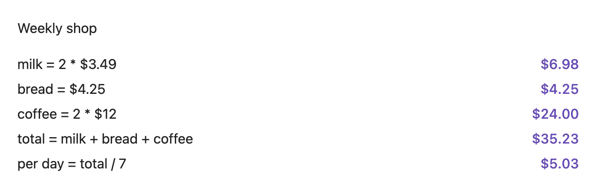</a><br><a href="examples/Instacalc%20Tutorial/Showcase/Groceries.ic.md"><b>Calc-first notes</b></a><br><sub>Name a note .ic.md and every line computes, with no code blocks</sub></td></tr>
<tr><td align="center" valign="top" width="33%"><a href="examples/Instacalc%20Tutorial/Showcase/Present%20view.md">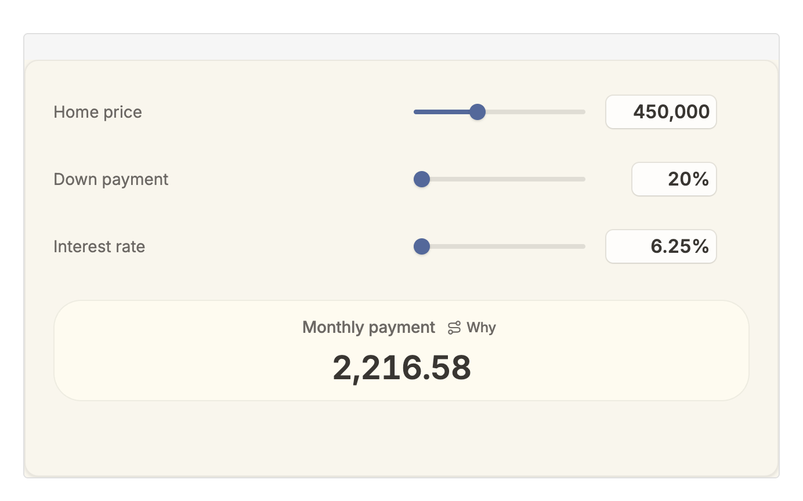</a><br><a href="examples/Instacalc%20Tutorial/Showcase/Present%20view.md"><b>Present view</b></a><br><sub>The same rows as a clean page with sliders, in the Web view</sub></td><td align="center" valign="top" width="33%"><a href="examples/Instacalc%20Tutorial/Showcase/Text%20view.md">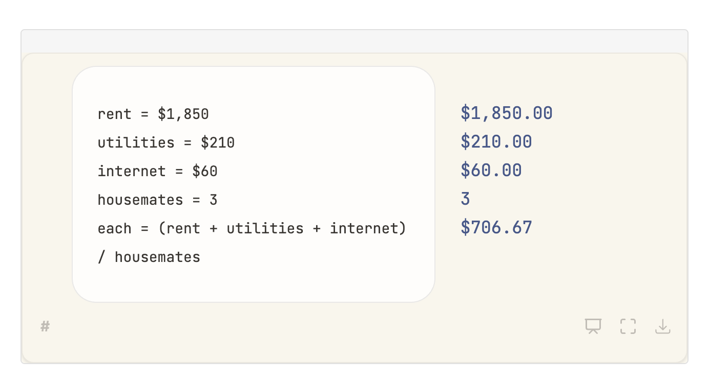</a><br><a href="examples/Instacalc%20Tutorial/Showcase/Text%20view.md"><b>Text view</b></a><br><sub>Plain lines on the left, answers on the right, in the Web view</sub></td></tr>
</table>

<details>
<summary>The tutorial, lesson by lesson</summary>

One short demo per lesson of the built-in tutorial. Click a picture for the animation, or a title
for the lesson note (they are also in the [example vault](examples/Instacalc%20Tutorial/)).
Every number in these demos is one the tutorial promises and the plugin's test suite checks.

<table>
<tr><td align="center" valign="top" width="33%"><a href="media/lessons/01-start-here.gif">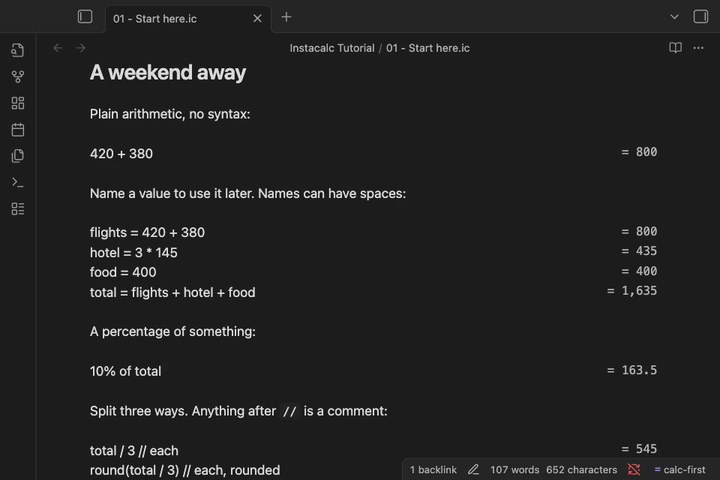</a><br><a href="examples/Instacalc%20Tutorial/01%20-%20Start%20here.ic.md"><b>Start here</b></a><br><sub>arithmetic, named values, percentages, comments</sub></td><td align="center" valign="top" width="33%"><a href="media/lessons/02-units-and-currencies.gif">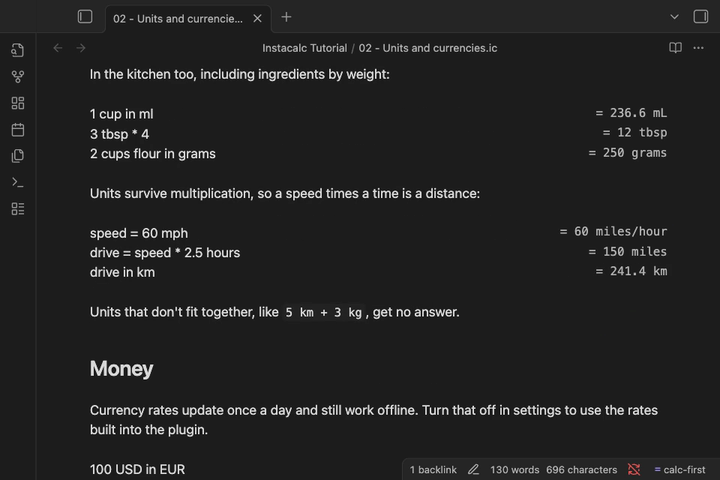</a><br><a href="examples/Instacalc%20Tutorial/02%20-%20Units%20and%20currencies.ic.md"><b>Units and currencies</b></a><br><sub>conversion, units through a product, offline money</sub></td><td align="center" valign="top" width="33%"><a href="media/lessons/03-notes-that-calculate.gif">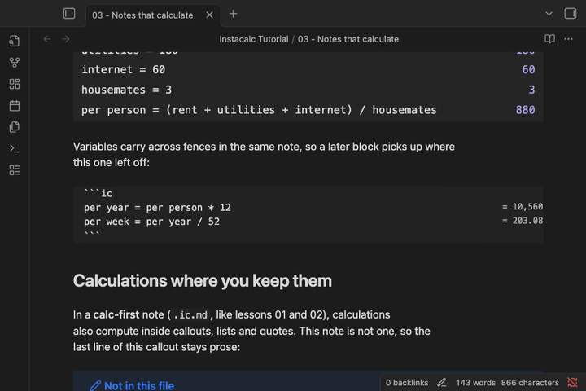</a><br><a href="examples/Instacalc%20Tutorial/03%20-%20Notes%20that%20calculate.md"><b>Notes that calculate</b></a><br><sub>fences, variables across blocks, callouts</sub></td></tr>
<tr><td align="center" valign="top" width="33%"><a href="media/lessons/04-charts.gif">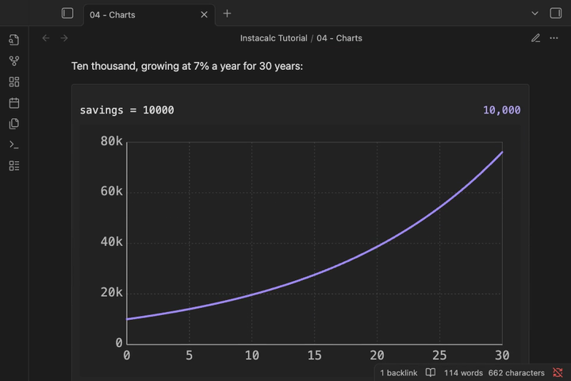</a><br><a href="examples/Instacalc%20Tutorial/04%20-%20Charts.md"><b>Charts</b></a><br><sub>bar, donut, line and 3D charts, drawn offline</sub></td><td align="center" valign="top" width="33%"><a href="media/lessons/05-reading-other-notes.gif">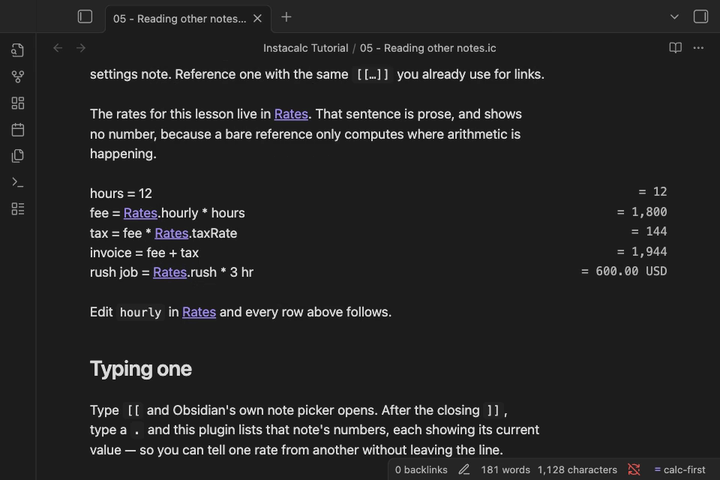</a><br><a href="examples/Instacalc%20Tutorial/05%20-%20Reading%20other%20notes.ic.md"><b>Reading other notes</b></a><br><sub>[[references]], completion, stated failures</sub></td><td align="center" valign="top" width="33%"><a href="media/lessons/06-totals-across-the-vault.gif">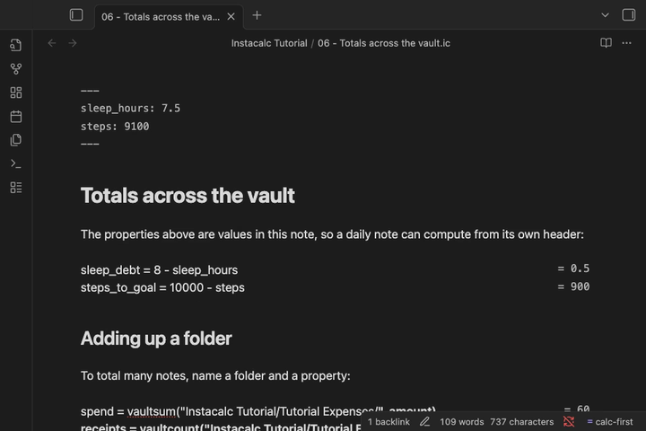</a><br><a href="examples/Instacalc%20Tutorial/06%20-%20Totals%20across%20the%20vault.ic.md"><b>Totals across the vault</b></a><br><sub>frontmatter variables, folder queries</sub></td></tr>
<tr><td align="center" valign="top" width="33%"><a href="media/lessons/07-tables-of-data.gif">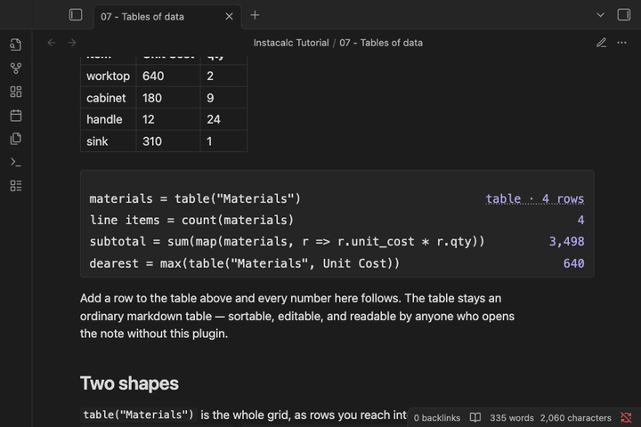</a><br><a href="examples/Instacalc%20Tutorial/07%20-%20Tables%20of%20data.md"><b>Tables of data</b></a><br><sub>table(…), how a table is named, refusals</sub></td><td align="center" valign="top" width="33%"><a href="media/lessons/08-results-in-a-sentence.gif">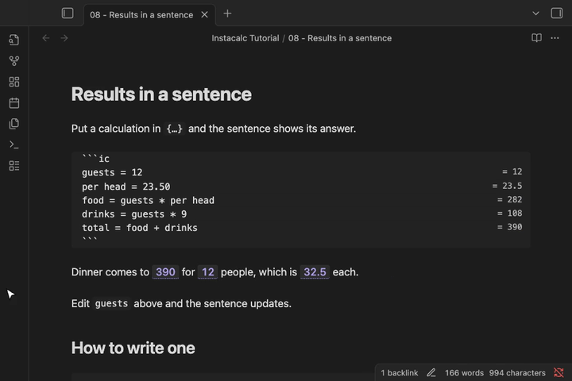</a><br><a href="examples/Instacalc%20Tutorial/08%20-%20Results%20in%20a%20sentence.md"><b>Results in a sentence</b></a><br><sub>inline results, and the number they will not show</sub></td><td align="center" valign="top" width="33%"><a href="media/lessons/09-calculus.gif">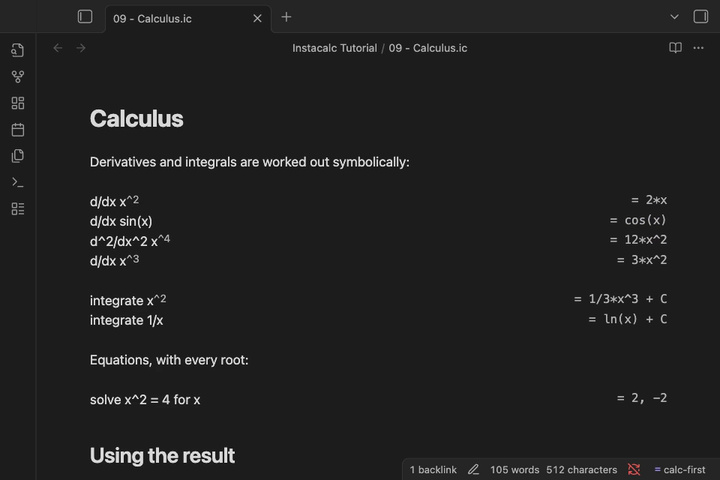</a><br><a href="examples/Instacalc%20Tutorial/09%20-%20Calculus.ic.md"><b>Calculus</b></a><br><sub>derivatives, integrals, solve</sub></td></tr>
<tr><td align="center" valign="top" width="33%"><a href="media/lessons/10-making-a-note-presentable.gif">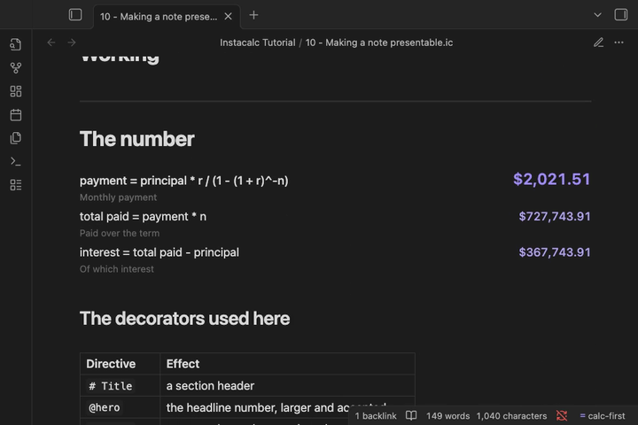</a><br><a href="examples/Instacalc%20Tutorial/10%20-%20Making%20a%20note%20presentable.ic.md"><b>Making a note presentable</b></a><br><sub>the decorators, as a loan document</sub></td><td align="center" valign="top" width="33%"><a href="media/lessons/11-formulas-that-compute.gif">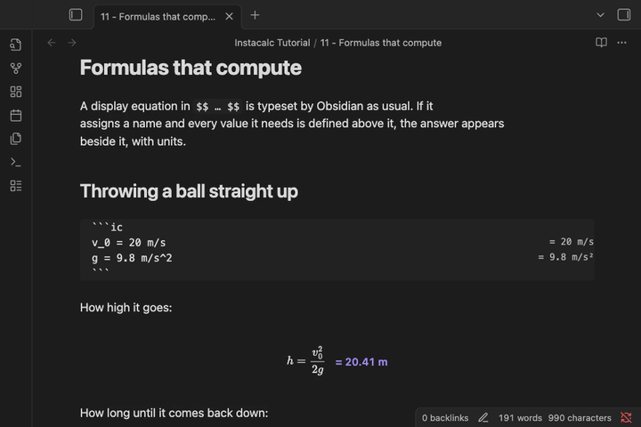</a><br><a href="examples/Instacalc%20Tutorial/11%20-%20Formulas%20that%20compute.md"><b>Formulas that compute</b></a><br><sub>$ LaTeX with answers, using values from a fence</sub></td><td align="center" valign="top" width="33%"><a href="media/lessons/12-drag-to-explore.gif">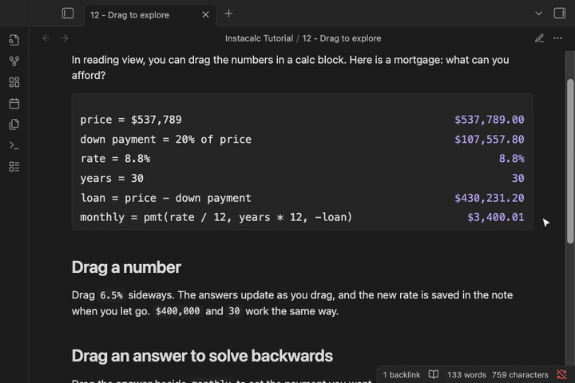</a><br><a href="examples/Instacalc%20Tutorial/12%20-%20Drag%20to%20explore.md"><b>Drag to explore</b></a><br><sub>drag a number to scrub it, drag an answer to solve backwards</sub></td></tr>
<tr><td align="center" valign="top" width="33%"><a href="media/lessons/13-insert-picker.gif">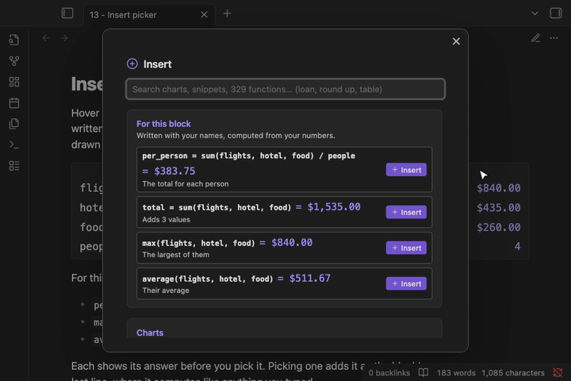</a><br><a href="examples/Instacalc%20Tutorial/13%20-%20Insert%20picker.md"><b>Insert picker</b></a><br><sub>the + picker: suggestions with your names, charts from your numbers</sub></td><td align="center" valign="top" width="33%"><a href="media/lessons/14-share-and-present.gif">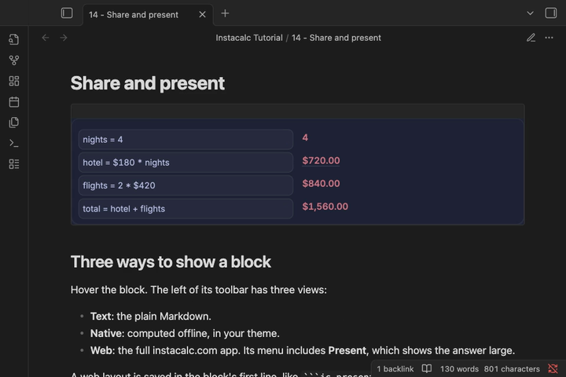</a><br><a href="examples/Instacalc%20Tutorial/14%20-%20Share%20and%20present.md"><b>Share and present</b></a><br><sub>Text, Native and Web views; Present; share links</sub></td></tr>
</table>

</details>
<!-- lesson-gallery:end -->

## Known issues

<!-- One line per issue; delete the line when its fix ships. The trailing comment names the tracking issue. -->
- Autocomplete can be noisy while you type, and its list can cover the block. <!-- #4313 -->

<!-- network-use:start (generated by pnpm obsidian:lesson-demos; edits here are overwritten) -->
## Privacy

Your notes stay in your vault. Every calculation runs on your device, and you don't need an account. The plugin never tracks what you type or which features you use.

It goes online in five cases:

- **Update check (on by default).** Once a day the plugin asks instacalc.com whether there's a newer version, and sends its version number so it can tell. We also count these checks to learn roughly how many people use the plugin each day. For that count our server keeps the date, the plugin version, your country, and a code made from your IP address and browser info with a key that changes every day. We don't keep your IP address or browser info, and a code can't be matched to you on any other day. To turn it off: Settings → Instacalc → Check for updates.
- **Exchange rates (on by default).** Once a day it downloads current currency rates from instacalc.com. Nothing about you is sent. To turn it off: Settings → Instacalc → Update exchange rates.
- **Web view or share link.** When you open a calculation in the Web view or share a link, that calculation (plus any values it uses from other notes) goes into the instacalc.com link. Anyone with the link can open it. Nothing is stored on our server.
- **Send feedback.** Only when you send the form: your message, your app versions, and the calculation if you choose to attach it.
- **`import()` in a calculation.** Only when a calc you wrote calls `import()` on a URL: the plugin fetches that URL (a Google Sheet, a Datasette query, a CSV or JSON file) from the site you named, the way a browser would open it. Nothing else is sent, and nothing goes to instacalc.com unless the URL is ours. Reading a `.csv` file from your vault with `csv("file.csv")` stays on your device.

(The tutorial notes include demo GIFs hosted in this GitHub repository, like any image link in a note.)

The Web view and share links open instacalc.com, where the site's own [privacy policy](https://instacalc.com/privacy) applies.
<!-- network-use:end -->

## Roadmap

Here is what I hope to build next. Come tell me what would help you most in [Discussions](https://github.com/kazad/instacalc/discussions).

- **Save to an instacalc.com account:** Save a block to your online calculations, and pull saved calculations into a note.
- **Obsidian community plugins list:** Install without BRAT once the beta is stable.
- **Mobile polish:** Make dragging and pickers easier to use on phones and tablets.

## Feedback

If you find a bug or have an idea, click the **beta** tag on any calc block to send it to me. You can also post in [Discussions](https://github.com/kazad/instacalc/discussions) or chat on [Discord](https://discord.gg/ADQ4BGXNaK).

## License

This plugin is free to use, all rights reserved ([LICENSE](LICENSE)). You can find details on open-source parts in [THIRD_PARTY_NOTICES.md](THIRD_PARTY_NOTICES.md).
