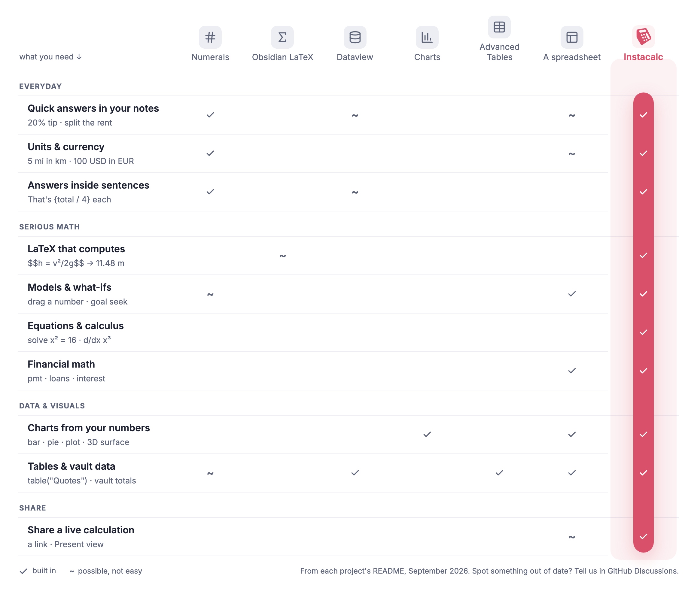

# Instacalc for Obsidian (beta)

I made this plugin so you can do math, convert units, draw charts, and run LaTeX right inside your notes.

[](media/tour.mp4)

> **Beta:** This plugin is in development and may be unstable. The Obsidian-specific syntax, like `{…}` answers and how you query your vault, may change slightly before 1.0. BRAT keeps you on the latest build.

## How it compares

<picture>
  <source media="(prefers-color-scheme: dark)" srcset="media/compare-dark.png">
  
</picture>

## What it does

- Write math using plain words, like `rent = $1,850/month` and then `rent * 1 year`. Units and currencies convert automatically.
- Put answers right inside your sentences by writing `{total / 4}` anywhere in a paragraph.
- Calculate LaTeX formulas, so `$$\frac{1}{2} \cdot 9.8 \cdot 3^2$$` shows its answer.
- Make charts from your numbers by adding a `barchart` or `piechart` line to a block.
- Try out what-ifs by dragging a number, or drag an answer to solve backwards.
- Use values from around your vault, including `[[Budget]].limit`, markdown tables, and folder totals.
- Name a note `.ic.md` to make every line compute.
- Share your work with one click. It makes a link with the whole calculation in the URL path.

## Install

You will need the [BRAT](https://obsidian.md/plugins?id=obsidian42-brat) plugin first to keep this beta up to date.

1. Install BRAT.
2. In BRAT, add `kazad/instacalc-obsidian`.

After that, open the command palette and run **Instacalc: Create tutorial notes**, or you can [read the tutorial here](examples/Instacalc%20Tutorial).

The plugin checks for updates once a day and lets you know when a new version is ready. You can turn this off in settings; see [Privacy](#privacy) for exactly what it sends.

## Recipes

You can paste any of these examples into a note to try them out.

**Split a bill**
````markdown
```ic
bill = $86.40
tip = 18% of bill
each = (bill + tip) / 4
```
````

**An answer inside a sentence**
````markdown
```ic
guests = 8
total = $260
```
Dinner comes to {total}, which is {total / guests} each.
````

**Trip budget in another currency**
````markdown
```ic
hotel = 180 USD * 6
flights = 1450 USD
total = hotel + flights
total in EUR
```
````

**Units and dates**
````markdown
```ic
5 km in miles
today + 90 days
```
````

**A value from another note** (its frontmatter has `hourly: 150`)
````markdown
```ic
fee = [[Rates]].hourly * 12
```
````

**Add up a folder** (each note has `amount: 12` in its frontmatter)
````markdown
```ic
spend = vaultsum("Expenses/**", amount)
```
````

**Sum a column of a markdown table** in the same note
````markdown
```ic
sum(table("Materials", Cost))
```
````

**Chart it**
````markdown
```ic
rent = 1850
food = 600
fun = 300
piechart
```
````

## Using your vault

Your notes' properties (frontmatter) are numbers you can calculate with.

| Write | You get |
|---|---|
| `rate * hours` | `rate` from this note's own properties |
| `[[Rates]].hourly` | the `hourly` property of the note Rates |
| `[[Rates]]` | that note's main number (`value`, `result`, `total` or `amount`, or its only number) |
| `vaultsum("Expenses/*", amount)` | `amount` added up across a folder; also `vaultavg`, `vaultmin`, `vaultmax`, `vaultcount` |
| `vaultsum("#trip", cost)` | the same, for every note with a tag |
| `vaulttable("#project", budget, status)` | one row per note, to sum, filter or chart |
| `table("Materials", Cost)` | a column of a markdown table in this note |

Properties can carry units and currencies (`weight: 12 kg`, `price: 40 EUR`), and answers update when those notes change.

## Share links

When you create a share link, the calculation is written directly into the URL path. Rows are joined by `;`, spaces become `_`, and the note name comes first:

```
https://instacalc.com/%23_Japan_trip;nights_=_6;hotel_=_180_USD_*_nights;hotel_in_JPY
```

Anyone with the link can open it and see the live calculation. They do not need Obsidian or an account, and nothing is stored on a server. Any values pulled from other notes are written into the link too, so it works completely on its own.

<!-- lesson-gallery:start (generated by pnpm obsidian:lesson-demos; edits here are overwritten) -->
<!-- lesson-gallery:end -->

<!-- network-use:start (generated by pnpm obsidian:lesson-demos; edits here are overwritten) -->
## Privacy

Your notes stay in your vault. Every calculation runs on your device, and you don't need an account. The plugin never tracks what you type or which features you use.

It goes online in three cases:

- **Update check (on by default).** Once a day the plugin asks instacalc.com whether there's a newer version, and sends its version number so it can tell. We also count these checks to learn roughly how many people use the plugin each day. For that count our server keeps the date, the plugin version, your country, and a code made from your IP address and browser info with a key that changes every day. We don't keep your IP address or browser info, and a code can't be matched to you on any other day. To turn it off: Settings → Instacalc → Check for updates.
- **Web view or share link.** When you open a calculation in the Web view or share a link, that calculation (plus any values it uses from other notes) goes into the instacalc.com link. Anyone with the link can open it. Nothing is stored on our server.
- **Send feedback.** Only when you send the form: your message, your app versions, and the calculation if you choose to attach it.

(The tutorial notes include demo GIFs hosted in this GitHub repository, like any image link in a note.)

Details: [instacalc.com/privacy](https://instacalc.com/privacy).
<!-- network-use:end -->

## Roadmap

Here is what I hope to build next. Come tell me what would help you most in [Discussions](https://github.com/kazad/instacalc/discussions).

- **Save to an instacalc.com account:** Save a block to your online calculations, and pull saved calculations into a note.
- **Obsidian community plugins list:** Install without BRAT once the beta is stable.
- **Mobile polish:** Make dragging and pickers easier to use on phones and tablets.

## Feedback

If you find a bug or have an idea, click **beta** on any calculation, or post in [Discussions](https://github.com/kazad/instacalc/discussions).

## License

This plugin is free to use, all rights reserved ([LICENSE](LICENSE)). You can find details on open-source parts in [THIRD_PARTY_NOTICES.md](THIRD_PARTY_NOTICES.md).
